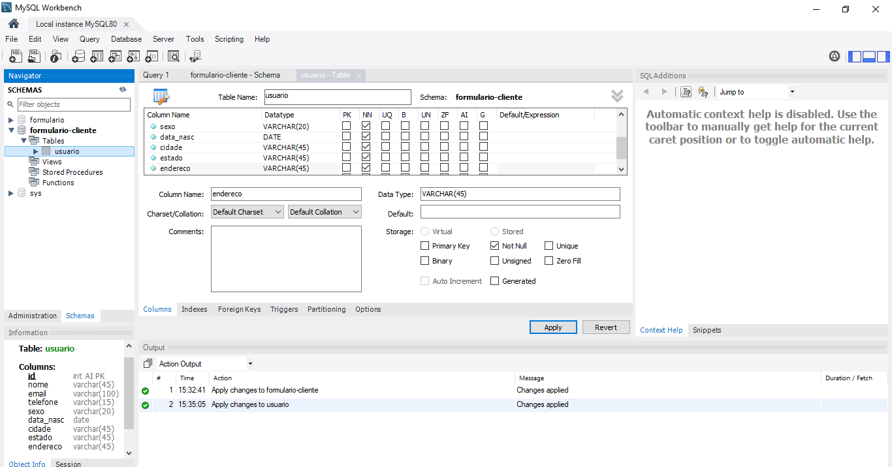
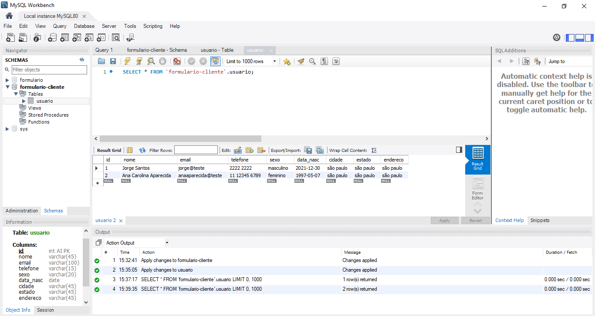

<h1>Formulário criado com banco de dados workbench</h1>

<h3>Formulário</h3>

<h3>Banco de dados</h3>

<h3>Dados armazenados no banco</h3>

Criei esse formulário seguindo um tutorial, que liga e salva os dados cadastrados no banco de dados.

<h2>Tecnologias utilizadas:</h2>

<ul>
    <li>HTML</li>
    <li>CSS</li>
    <li>PHP</li>
    <li>MYSQL / Workbench</li>
</ul>

Para rodar o projeto na sua máquina, você pode baixar o projeto zipado na sua máquina ou clonar. Para rodar o projeto será necessário ter o xampp instalado no seu local. Feito isso, é só colocar a pasta no htdocs, startar o xampp, e digitar localhost + o nome da pasta no seu local, por exemplo: http://localhost/FormularioBD/formulario-clientes.php.

Para criar a tabela no banco de dados, instalei o mysql com o workbench, abri o workbench, cliquei na opção de conexão com o localhost, criei a coluna e as tabelas, depois disso efetuei a conexão no arquivo config.php, no meu caso foi necessário colocar a senha do meu banco para efetuar a conexão

